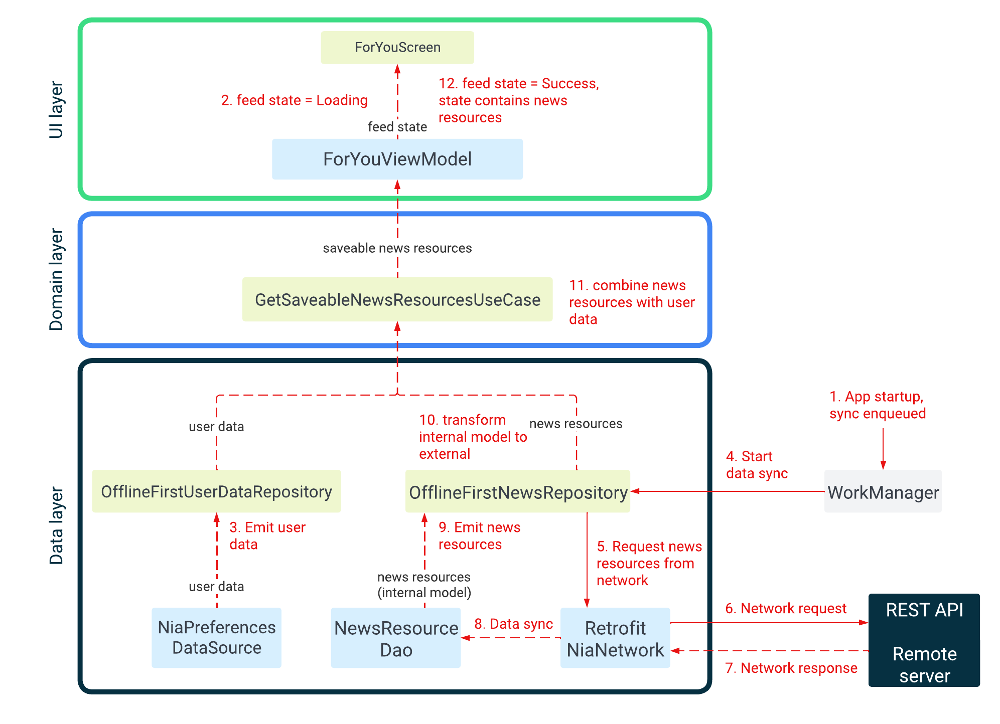

# WhereThereIs4Cast
==================

A play project that shows the weather forecast. This is the repository: https://github.com/SelloN/WhereThereIs4Cast

**WhereThereIs4Cast** is a fully functional Android app built entirely with Kotlin and Jetpack Compose. It
follows Android design and development best practices using Clean Architecture. The following are the third party
libraries used. The others are all from the google framework (jetbrains included). 

retrofit = {group = "com.squareup.retrofit2", name="retrofit", version.ref = "retrofit"}
gson = {group = "com.google.code.gson", name="gson", version.ref = "gson"}
converter-gson = {group = "com.squareup.retrofit2", name="converter-gson", version.ref = "retrofit"}
coil-compose = { module = "io.coil-kt:coil-compose", version.ref = "coilCompose" }

The architectural approach follows this standard with the respective libraries:

